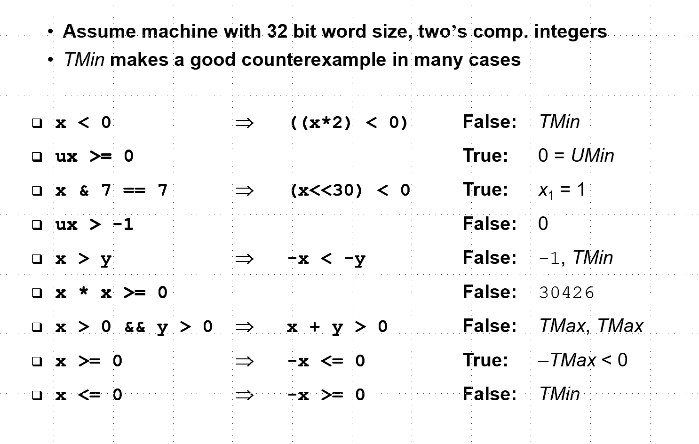

##  第2章 信号的表示和处理

```
考点
整数浮点数的表示，运算，ppt上有两页，定点数，判断是真是假
```

考题：



由于精度优先，浮点运算是不可结合的。

###  2.1 信息存储

8个bit是一个**字节**，机器级程序将内存视为一个非常大的**字节数组**，称为**虚拟内存**。

#####  2.1.1 十六进制表示法

二进制和十六进制转换：

* 十六进制->二进制：每四位展开；

* 二进制->十六进制：从右到左每四位合并；

* 窍门：记住0xA：1010；0xC：1100； 0xF：1111

十进制和十六进制转换：

* 十进制先转化为二进制-> 再转化为十六进制；
  * 特殊的是：十进制正好可以写成$2^n$，此时转化为二进制正好是1后面n个0。将n 写成 $n=i+4j$，则写成十六进制是$0x2^i000(j个0)$
  * 也可以使用除数16的除法来做。
* 十六进制转化为十进制：略

#####  2.1.2 字数据的大小

**计算机字长**：指明**指针数据**的标称**大小**，最重要的决定因素是**虚拟地址的空间大小**。

例如：32位机器，虚拟地址范围是$0 - 2^w-1$。程序最多访问$2^w$个字节。（注：32位机器，意味着每一个指向地址的指针的值有32位，即4B）

## 第5章 优化程序性能

```
考点： 结合第六章 数组/ 命中率/ 优化 /Cache / 调整
```

总结：如何消除数组计算的低效率？

* **代码移动**——将确定的函数值用局部变量替代
* 循环中**减少过程调用**——尤其是要减少代码中没有必要的内存引用*dest；而是将内存引用赋值给局部变量acc
* **循环展开**
* CPU微体系结构，**指令并行**
* 略


### 5.1 优化编译器的能力和局限性

编译为对代码的优化也许是不安全的。

**（1）妨碍优化的因素：内存别名引用**


twiddle2是twiddle1的优化版本，因为twiddle2中只有3次内存引用，而twiddle1有6次；但是，当xp==yp时，两者产生的结果不一样；

“**内存别名引用**”时，两个指针指向内存同一个位置。

```
int *q = &x，指针q指向x，指针q的值确定
int *q, *q = x, 指针q指向的位置（指针q的位置并不确定）赋值为x的值
```


同样有歧义，q和p的值也许指向同一个位置，则此时*p后赋值，值为1000；

若q和p不指向同一个位置，则*q的值为3000；

**（2）妨碍优化的因素：函数调用**


调用一次函数，修改了全局变量的值；由于优化版本调用函数的次数不同，所以全局变量的值不同。

```
在func1中使用“内联函数替换”进行替换，可以有效解决这个问题。
```


###  5.2 表示程序性能

使用CPE（cycles per element）来度量程序的性能，在循环中，计算每一个数组元素的时钟周期数。

度量程序的循环性能。

```
处理器的时钟频率：单位是GHZ，吉赫兹，10的9次方，即10亿赫兹；
时钟周期是时钟频率的倒数，单位是纳秒，10的-9次方。
```

计算前置和的例子：


psum1的循环步长为1，psum2的循环步长为2；

结论是：psum2中每个元素的时钟周期数是6，要大于psum1的时钟周期数；


###  5.3 程序示例

数据结构定义：


数据结构图解：


创建一个特定长度的向量：（很标准的结构体动态分配内存的代码）

给出数组长度，初始化上述结构体，并返回指向上述结构体的指针；


* 堆区，分配vec_rec大小的空间，强制转换为vec_ptr指针指向的格式，用result指针指向该结构体；
* 如果分配失败，返回null；
* 赋初值：为结构体中指针指向的数组*data动态分配内存，使用calloc()函数，为数组分配长度为len的空间并且初始化为0，使用data指针指向数组；
* 如果分配失败，要先释放result指针（free），再返回null；
* 将data赋值给结构体的指针域，返回result指针。

以下两个函数返回特定位置的值，或者返回向量的长度；


定义元素求和或者求积运算：


当调高编译器的优化级别时，无论是加法还是乘法，循环的CPE都会显著减少。  


###  5.4 消除循环的低效率

**代码移动：**将计算结果不变的函数调用，从循环中提取出来，赋值给局部变量。

将循环测试条件vec_length()提前计算出来，赋值给局部变量length；在循环中家安少了函数的调用，得到的CPE比上述-O1优化要低。


注意：编译器可能无法识别，故需要程序员显式地进行代码移动。

例如：在字符串中，对字符的依次处理经常需要用到函数 strlen(s)；

此函数的时间复杂度O($n^2$)，故从循环中提出可以减少CPE。

###  5.5 减少过程调用

上述代码，在循环体中，使用了过程调用：get_vec_element(v, i, &val)；这个函数需要将索引 i 与数组长度先作比较，若合法，复制该位置的值到val中。在这里，显然时比较多余的，因为i在循环条件中已经经过判断（i < length），肯定不会越界；


为了减少CPE，新增函数get_vec_start(); 先获得数组指针，直接读取值；


但是此时，虽然减少了越界检查的次数，但是性能没有明显提升。原因见下一节；

###  5.6 消除不必要的内存引用

将上述conbine3内循环的汇编代码拿出来：


* rbx指向内存，内存存放*dest的值，一次内存引用，复制 dest到寄存器 xmm0中；

* rdx指向data数组，一次内存引用，将值从数组中取出，与xmm0相乘；

* 一次内存引用，xmm0的值存回rbx指向的内存；（以上发生三次内存引用）

* 数组指针移动到下一位；

* 越界检查；

可以发现，xmm0这个内存引用其实是没有必要的：每一轮，将*dest的值从内存读出，OP上数组元素后，又存回内存；下一轮读出的还是这个值；

**修改：**


增加局部变量acc，替代*dest，用于存储累加、累积的值；

汇编代码中的 xmm0存放的不是dest的内存引用，而是局部变量acc；最后一次迭代将acc的值赋值给dest的内存引用。

这样在每一轮循环中，可以减少两次内存引用。

减少了CPE。

同样，这一步需要人为优化。

###  5.7 理解现代处理器（略）

以上优化不依赖于机器目标的任何特性，只是降低了过程调用的开销，消除了重大的"妨碍优化的因素"；以下考虑处理器微体系结构的优化。

###  5.8 循环展开（略）

增加每一次迭代计算的元素数量，减少循环的迭代次数如psum2()；

###  5.9 提高并行性（略）

###  5.10 优化合并代码的结果小结（略）

###  5.11 一些限制因素（略）

###  5.12 理解内存性能（略）

------


##  第6章 存储器的层次结构

```
考点：
缓存对性能的影响，失效率、命中率
```

实际上，存储器系统是一个层次结构。


###  6.1 存储技术

#####  6.1.1 随机访问存储器 RAM

**RAM都是断电易失的存储器**。

**SRAM：**静态RAM：双稳态管、稳定；**无需刷新；速度快**，花费高；用于高速缓冲存储器。

**DRAM：**动态RAM：电容+1个晶体管，对干扰很敏感，内存系统需要周期性读出重写来**刷新**每一位；访问时间较慢，花费低，用于主存。

**传统的DRAM芯片的单元：**


* 有16个**超单元**，一共被组织成4行4列的方阵，可以通过坐标（i，j）定位到芯片上某个超单元的位置；
* 每1个超单元，都由w个DRAM单元组成（即上述的携带了1bit数据的DRAM单元）；这里w=8，则每个超单元携带1B的数据。
* <u>芯片</u>与<u>内存控制器</u>之间通过**引脚**连接，每条引脚携带**1bit**数据；data引脚有8个，每次传输1B的数据（一个超单元）；地址引脚有2个，单向，每次携带2bit的行列超单元地址。
* **行列地址复用**，有效减少地址引脚的数量；2bit能够携带4种不同的信息（需要翻译），对应4行或者4列，所以行列共享引线。
* 内存控制器发送行地址后，DRAM将整行都复制到**内部行缓冲区**；发送列地址，从内存缓冲区复制超单元，到内存控制器。

```
这里的“超单元”，在一些领域，称为“单元”、“字”。
题目中给出DRAM阵列是（a，b），则a是超单元个数，b是超单元中的位数。
```

**内存模块：**分装了若干上述内存芯片。


也就是，当内存控制器发送地址（i，j）时，地址广播到每一个芯片，取出1B内容，电路将8个芯片的输出合成64bit，返回内存控制器。

**ROM：只读存储器，断电保存，非易失。**我们用的u盘、电脑的固态硬盘就是非易失性存储器。存储在ROM中的程序叫做固件。

**主存访问**：

CPU和DRAM主存之间，使用bus连接。数据传送分为读事务（主存->CPU）和写事务（CPU->主存）。

计算机系统的配置如下：


IO桥也将bus连接到IO总线（这里没有画出来）

读事务的步骤：movq A，%rax

* 总线接口发起读事务；
* CPU将地址放到系统总线上，IO桥将其转化为内存总线（表明并非是到其他IO设备）；
* 内存总线读取地址，从DRAM中取出数据字，写到内存总线；
* 内存总线被IO桥翻译成系统总线信号；
* CPU读取系统总线数据，读取数据，复制到寄存器中。

#####  6.1.2 磁盘存储

略

###  6.2 局部性

**时间局部性：**被引用的内存位置在不远的将来再次被引用。（**同一位置**）

**空间局部性：**程序很可能在不远的将来引用附近的内存的一个位置。（**不同位置**）

#####  6.2.1 对程序数据引用的局部性

数组：步长为1的顺序引用模式，有很好的空间局部性；但是每个元素只访问一次，所以没有时间局部性；

多维数组：$a[m][n]$，行优先顺序读取也是步长为1，有良好的空间局部性；但是如果是列优先读取，则没有很好的空间局部性。

#####  6.2.2 取指令的局部性

程序指令放在内存中，CPU必须读出这些指令；

如for循环体中的指令，是顺序的，有很好的空间局部性；同时，for循环体会被执行多次，有很好的时间局部性。

#####  6.2.3 局部性小结

* **同一个变量**被重复引用，是很好的时间局部性；
* 顺序引用模式如数组，步长越小，空间局部性越好；
* 对于指令来说，循环有好的时间和空间局部性。

###  6.3 存储器层次结构

#####  6.3.1 存储器层次结构中的缓存

高速缓存cache是主存的缓存，交换的数据被称为“块”；

**缓存命**中，从cache层中读取了下一层的缓存，称为cache层缓存命中。

**缓存不命中**，此时需要从下一层取出需要的块放入cache中；如果此时cache满了，还需要一个**“替换策略”**，选择牺牲掉的块。

缓存不命中的种类：

* 空的缓存叫做冷缓存，此时不命中叫作**冷不命中**；
* **冲突不命中**。

缓存管理：

* 编译器管理寄存器文件
* L1、L2、L3层的缓存是由内置在缓存中的硬件逻辑来管理的。
* DRAM由操作系统和CPU上的地址翻译硬件来管理的

###  6.4 高速缓存存储器

cpu寄存器和主存之间插入一个小的SRAM高速缓存存储器。


#####  6.4.1 通用的高速缓存存储器的组织结构（考点）

内存的地址结构（一定是**物理地址**！）：


cache结构：


一共S组，每组E行，每行有B字节数据块；

除此之外，标记为大小t = m-b+s；有效位1位。

#####  6.4.2 直接映射 高速缓存（内存的块映射到唯一缓存行）

每组只有一行，E=1；即高速缓存有多少行，就有多少组；每个物理地址只能映射到每组唯一的位置。

三步：**组选择、行匹配、字抽取**


**组选择：**利用地址中的组索引，将cache看成一个数组

**行匹配：**利用行中的有效位和标记位

**字抽取：**数组的访问

**不命中时的替换策略 ：**从下一层次取出被请求的块，将唯一对应的行替换掉。

**直接映射高速缓存中的冲突不命中的例子：**


考虑以上两个向量点乘。

按理说，由于存在数组，函数有良好的空间局部性；但事实上若高速缓存由两个组构成，每个组大小是32字节，直接映射。


交替访问x和y是发生缓存不命中。

在上述例子中，即使程序由良好的空间局部性，高速缓存也有足够的空间，每次引用还是会导致冲突不命中，因为这些块被映射到相同的高速缓存组。

为了解决上述问题，可以在x数组后填充32B，此时映射关系如下：


#####  6.4.3 组相联高速缓存（内存的块映射到缓存的某一组）

**组选择：**使用地址中的组索引标识组；

**行匹配：**确定了组之后，要检查组中的多行中的标记位和有效位。组相联高速缓存中的每个组都可以看成小的相联存储器。

**行替换**：LFU、LRU

#####  6.4.4 全相联高速缓存（内存的块映射到缓存的任意行）

把整个高速缓存看成一组。地址结构如下：


并行搜索标记，困难且昂贵。所以只能做成小的，例如TLB翻译备用缓冲器，缓存页表项。

用6.12的例题复习

#####  6.4.5 关于写的问题

**写命中：**

直写法：当高速缓存写命中时，立刻更新低层次中的副本。

写回法：只有当页面要被替换算法替换时，写回低层次中。此时高速缓存要增加一个脏位表明该页面是否被修改过。

**写不命中：**

写分配：先从低一层先将块加载入高速缓存中再写；

非写分配：直接在下一层写。

#####  6.4.6 一个真实的高速缓存层次结构的解剖（略）

#####  6.4.7 高速缓存参数的性能影响

* 不命中率：内存引用的 不命中数量/引用数量
* 命中率： 1 - 不命中率
* 命中时间：高速缓存传送一个字到CPU的时间。

命中率的影响因素：

* 高速缓存容量大，会提高命中率。（存放了较大比例的下一层的副本）
* 块大小：不好确定，块越大可以利用空间局限性，但是块越大减少行数。
* 相联度：**n路组相联**指的是一组有n行。相联度高的意思是，n大。

###  6.5 编写高速缓存友好的代码（考点）

* 对于**局部变量**的反复引用是好的，优化良好的服务器可以将他们缓存在寄存器中。（减少内存引用也可以可以减少时间开销）

* 数组中，步长为1的引用模式是好的，因为存储器层次结构的所有缓存都是将数据存为**连续的块**，可以利用空间局部性。

**可以反复做例题6.17-6.20.**

```
题目给出的高速存储器一般是直接映射（组=行）；写不命中采用写分配策略（将下一层的块调入上一层）
首先将数组在内存中的排序写下来；
确定cache中每一块可以存放几个数组元素；（块内偏移几位）
确定cache能否装下整个数组；
按照代码给出的顺序，看是否命中。
```

###  6.6 综合：高速缓存对程序性能的影响（略）

###  6.7 小结

------


## 第7章 链接

```
考点：
merge 重定位
如何重定位，符号和地址的计算
进程在虚拟空间的布局
可能会出判断题
```

前提：运行于Linux的x86-64系统，目标文件格式：ELF-64.

###  7.1 编译器驱动程序

编译器驱动程序，如GCC，将ASCII码源文件翻译成可执行文件。


* cpp 预处理器
* ccl 编译器，生成ASCII汇编文件
* as 汇编器，生成**可重定位目标文件**
* ld 链接器，链接成**可执行目标文件**
* 运行可执行目标文件，加载器创建进程，为目标文件创建虚拟页，修改页表项。

###  7.2 静态链接

链接器的任务：

* 符号解析，这里的符号对应函数、全局变量或者静态变量。

  （这里以static修饰的是静态变量）

  作用是将符号定义和引用关联

* 重定位：将符号定义和内存位置关联起来。（我认为是虚拟地址）

###  7.3 目标文件

分类：

* 可重定位目标文件
* 可执行目标文件，是链接之后的可重定位目标文件，可以直接复制到内存执行。（静态链接）
* 共享目标文件，可加载或者运行时再加载入内存并且**链接**（不是静态链接）

###  7.4 可重定位目标文件

由编译汇编后生成的字节码文件。其结构如下：


组成：

* ELF头：系统字大小、字节顺序、ELF头大小、目标文件类型
* **.text：机器代码**
* .rodata : 只读数据
* **.data 已经初始化的全局或者静态变量**
* **.bss 未初始化、或者初始化为0的全局或者静态变量**
* **.symtab：符号表，定义和引用的函数和全局变量的信息**
* rel.text：text节中位置的列表
* rel.data：被模块引用或定义的全局变量的位置信息
* .debug：调试符号表
* .line：原始C程序行号和.text节机器指令的映射
* 节头部表：不同节的位置和大小

有时候看到简写成：


###  7.5 符号和符号表

符号分类：

* 本模块定义，能被其他模块引用的全局符号（无static修饰的全局变量和函数）
* 其他模块定义，能被本模块引用的全局符号（无static修饰的全局变量和函数）（作用中称为外部符号）
* 本模块定义的局部符号(有static修饰的静态变量)

```
c语言中的static一是表明了生存期是静态的，二是表明了作用域有限；
第二个作用相当于java中用private修饰变量或者函数，表明是私有的。
```

.symtab是符号表。其主要内容看书上例题。


```
* 这里的外部变量指别的模块定义的全局变量（没有static修饰）
* 这里的局部变量指有static修饰的限制了作用域的变量
* 注意bbs段和COMMON的区别：都存放未初始化变量，bbs存放静态，COMMON存放全局
```

###  7.6 符号解析

链接器的符号解析，指的是将**每个引用**和**符号表中的符号**关联起来。

对于局部符号（有static修饰的限定了作用域的），符号解析简单，每个模块的局部符号有唯一的名字和定义。

对于全局符号（没有static修饰的函数和写在函数外的变量），由于多个目标文件有相同的名字，链接器需要做出选择。

#####  7.6.1 链接器如何解析多重定义的全局符号

对于**全局符号**，编译器向汇编器输出的全局符号中，分为强弱。**函数和已经初始化的全局变量是强符号，未初始化的全局变量是弱符号。**

链接器使用如下三条规则处理多重定义的全局符号：

* 不允许存在多个重名的强符号
* 如果一个强符号和一个弱符号同名选择强符号
* 如果多个弱符号同名则任意选择

#####  7.6.2 与静态库链接

不使用的静态库的链接，有以下做法：

* Pascal可以让**编译器**辨认出对标准函数的调用，并且生成相关代码。

  这意味着对编译器版本有要求。

* 将**所有的标准C函数**放在**一个**可重定位目标模块中（如lib.o，编译汇编好），应用程序员将该模块链接到可执行文件中。

  整个标准函数打包在一起，每个程序都保存副本，是对磁盘和内存的浪费；不好修改。

* 为**每个标准函数**单独创建可重定位文件，存放在众所周知的目录（lib）中。

  需要程序员显式地链接，耗时易出错。

使用静态库：将**相关函数（若干）**编译为独立地**目标模块**，封装成单独地**静态库文件**，调用库来使用库中函数。


#####  7.6.3 链接器如何使用静态库来解析引用

所有的可重定位目标文件构成文件集合E；每个文件的符号加入尚未定义的符号U和已经被定义的符号D；

依次扫描存档文件中的文档成员，如果定义了符号解析U，将该文件加入E，修改U和D；

全部扫描完成，若U非空，报错。

------

## 第8章 异常控制流

###  8.4 进程控制

##### 8.4.1 获取进程ID

#####  8.4.2 创建和终止进程

进程的三个状态：

* 运行。（相当于408中的运行态和等待态）
* 停止。进程被挂起且不会被调度。
* 终止。三种原因：收到信号；从主程序返回；调用exit()。

`fork()`在进程中创建一个子进程。

* 子进程是父进程虚拟地址空间相同的一份副本，包括代码、数据段、堆栈、库、文件描述符。但是它们有不同的PID。
* `fork()`在父进程（调用进程）中返回子进程PID，在子进程中返回0.
* 父进程和子进程并发执行。

学会画前驱图，并且打印不同进程的输出结果。

自己的理解：当遇到fork()时，进程会分裂为2份，分别接着运行。但是fork()后，在父进程和子进程的返回值不同，所以如果if判断条件，也许会走向不同的分支。

#####  8.4.3 回收子进程

子进程先**终止**，再被父进程或者init()**回收**，在由内核抛弃此进程。

父进程可以使用以下函数


**options:** 

<u>0, 默认情况，**挂起**调用进程，直到其一个子进程终止，返回该子进程的pid。</u>

<u>WNOHANG：若等待集合中的子进程都没终止，立即返回0。（**不等了**）</u>

WUNTRACED：挂起调用进程，直到一个进程终止，返回导致返回的停止的子进程。

WCONTINUED：挂起调用进程，直到一个正在运行的进程终止或一个被停止的进程收到SIGCONT信号重新执行。

**pid：**规定了等待集合，pid>0，返回被回收子进程的pid；如果pid=-1，由父进程的所有子进程组成。


做题时记住 `waitpid(-1,&status,0)`:包含所有子进程、默认情况：挂起等待，返回终止子进程的pid。

#####  8.4.4 让进程休眠

即让进程挂起一段指定的时间，返回剩下要休眠的时间。

#####  8.4.5 加载并运行


------


## 第9章 虚拟内存

```
考点：虚拟地址和物理地址的转换，会给出TLB和cache的相关数据
不考mallloc
注意ppt上的两个例子
```

虚拟内存的三个能力：

* 将主存看成磁盘上地址空间的高速缓存。（主存是磁盘的copy）
* 每个进程有一致的地址空间。
* 保护每个进程地址空间不被其他进程破坏。

###  9.1 物理和虚拟寻址

物理寻址：主存被组织为由M个连续的字节大小单元的组成的数组。每一个单元都有唯一的物理地址（PA）。

虚拟寻址：


* CPU生成虚拟地址（VA）
* 将虚拟地址翻译成物理地址
* CPU访问主存

```
地址翻译：
*  硬件：集成在CPU芯片上的**内存管理单元**
*  使用存放在**主存中的地址查询表**（页表），该表由**操作系统**管理
```

###  9.2 地址空间

规定：地址空间的大小由描述最大地址的位数决定。如：n为地址空间，表示的地址范围是0 ~$(2^n-1)$。现代操作系统，n取32或者64（CPU所认为的，虚拟内存大小）。

而物理地址空间其实比虚拟地址空间小。

###  9.3 虚拟内存作为缓存的工具

虚拟内存被组织为**存放在磁盘**上的N个连续的字节大小的单元组成的数组。

主存中存放的是磁盘的缓存。

磁盘和主存之间传输数据使用“块”，块的大小是$P=2^p$字节；物理内存中，这个块叫做**“物理页”**或者**“页帧”**；虚拟内存中叫做“**虚拟页”**。

**虚拟页面**的集合有三种状态：

* 未分配的：虚拟系统还没有分配的页；
  * 磁盘上还不存在（那在哪？）没有与物理内存建立联系；
* 已分配的：虚拟内存的虚拟页和与物理内存的页框建立联系；
  * 缓存的：缓存在物理内存的已分配页；
  * 未缓存的：未缓存在物理内存的已分配页。

#####  9.3.1 DRAM 缓存的组织结构


（存储层次中，可以看作上一层存放了下一层的copy）

DRAM不命中，需要启动磁盘IO，磁盘IO速度很慢，这个代价很大，比SRAM不命中要高很多。

为了减少DRAM不命中，有以下措施：

* DRAM的缓存，即虚拟页的大小很大；
* DRAM的缓存是“全相联”的，即：任何虚拟页可以放在任意物理页中；
* 对于DRAM不命中的情况，则有更高效的替换算法；使用写回法：即该页面被换回去时，才修改硬盘中的页面。

#####  9.3.2 页表

页表提供这样一个功能：

* 判断虚拟页是否被缓存在DRAM上；
* 判断虚拟页缓存在DRAM的哪个物理页中；
* 若虚拟页没有缓存在DRAM上（未命中），需要在DRAM中寻找一个牺牲页，虚拟页将该页替换掉（则分配）。

页表功能实现：

* 操作系统软件（维护页表，在DRAM和磁盘之间传送页）
* 内存管理单元MMU的地址翻译硬件
* 位于物理内存DRAM中的页表

页表：虚拟地址空间中的每个页在页表中都有一个条目：

```
涉及到计算：
64位系统，每个页的大小是2^20B，则理论上一共有2^44个虚拟页面，页表中有2^44个页表条目。由此，计算出理论的页表大小。
```


* 有效位：该**已分配**的**虚拟页**是否**已缓存**
  * 为1，已分配，已缓存
  * 为0，分两种情况：
    * 地址为null，**未分配，未缓存**
    * 地址为**虚拟页在磁盘上的位置**，**已分配，未缓存**（不符合之前的记忆）

#####  9.3.3 页命中

#####  9.3.4 缺页

缺页即缓存不命中。

* 虚拟地址通过地址翻译硬件得到对应的页表项，但是该页表项的有效位为0，说明不命中。
* 触发缺页异常；注意此时物理内存是满的；
* 此时在DRAM中选择一个虚拟页替换，该牺牲页如果被修改过，则从DRAM复制回磁盘；否则，直接用新的虚拟页覆盖。
* 修改该页表项：
  * 调入的虚拟页的页表项，有效位为1，地址是被淘汰页面的物理块号；
  * 被淘汰页面的页表项，有效位改为0。

关于磁盘和DRAM之间的传送行为叫做：**页面调度**或者**交换**。

当不命中时才调度，叫做："按需页面调度"。

#####  9.3.5 分配页面

当我们调用malloc函数，此时发生了什么？操作系统分配了一个新的虚拟页面。

* 磁盘上创建空间。
* 创建页表项，使之指向**磁盘上的页面**。

即处于已分配未缓存的状态。

#####  9.3.6 还是使用了局部性

只要程序有很好的时间局部性，虚拟内存可以工作得很好；否则，工作集大于物理内存，导致虚拟页面频繁换入换出，称之为"抖动"。


###  虚拟内存：内存管理

之前假设虚拟地址空间-->映射到一个页表中。

事实上，操作系统为**每个进程提供了独立的页表**。

好处：

* 简化链接：无论程序的代码和数据存放在物理内存的何处，在Linux系统上的进程，在内存有相似的结构。

* 简化加载：向内存中加载可执行文件和共享对象文件更容易了。

  

  处于已分配未缓存状态。也就是说，程序和代码或者数据并非一次性被加载器加载到内存中，而是CPU发出指令时，才一次调入所需页面。

* 简化共享。

  每个进程有自己的代码、数据、堆、栈，操作系统创建页表，将虚拟页面映射到不连续的物理界面。但是有一些共享页面，如：操作系统内核代码，C标准库程序，操作系统可以将不同进程中的不同虚拟页面映射到相同的物理页面。

* 简化内存分配。<u>如malloc，操作系统要求分配k个连续个虚拟内存页面，事实上，可以映射到k个任意的物理内存页面中。</u>

  也就是说我在c语言中要求操作系统给我分配5个连续页面时，其实在内存中很有可能是离散的。但是程序员写的和cpu处理的都是连续的虚拟地址，由MMU转化为内存实际地址。

个人总结：计算机所看到的地址应当是“虚拟地址”，我们写代码是也应当考虑的是“逻辑地址”，而实际在内存中通过映射，实际地址是不确定的。

###  9.5 内存保护

在页表中，加入三个许可位，实现内存访问控制。

* SUP：为1，超级用户才可以访问，为0，都可以访问
* READ：可读
* WRITE：可写

###  9.6 地址翻译（考试重点）


**命中，**纯硬件处理，流程如下：

1. 处理器生成一个**虚拟地址**（CPU只看到虚拟地址），传递给CPU中的MMU（内存处理单元）

2. MMU由虚拟地址中的虚拟页号，以及基址寄存器的值，得到内存中**页表项地址**，向高速缓存/主存请求页表项；

   

   ```
   页表项地址 = 页表基址 + 虚拟页号 * 页表项大小  
   ```

3. MMU得到该**页表项地址**。
4. MMU计算**物理地址**，返回给主存/高速缓存

```
物理地址 = 页表中存储的物理页号 * 物理页大小 + 物理页偏移量
```

4. 高速缓存/主存将请求的**数据字**传递给处理器。


**若是缺页（不命中）**，流程如下：

1. 处理器生成一个虚拟地址（CPU只看到虚拟地址），传递给CPU中的MMU（内存处理单元）

2. MMU由虚拟地址中的虚拟页号，以及基址寄存器的值，得到内存中页表项地址，向高速缓存/主存请求该地址项；

3. MMU得到该页表项。

4. **MMU**发现页表项有效位是0，**触发异常**，传递CPU中的控制到**操作系统内核的缺页异常处理程序**。

5. 缺页处理程序确定牺牲页，如果有修改则换出到磁盘。

6. 缺页处理程序调入新的页面，并且更新内存中的PTE。

7. 返回04.

   

#####  9.6.1 结合高速缓存和虚拟内存 

高速缓存夹在MMU和内存之间，高速缓存存放的是物理地址-内存的映射，例如：

，


**直接映射**下，每一个物理块只能copy到高速缓存的唯一的一行，也就是说，**分组的时候，高速缓存有多少行就有多少组。**在高速缓存中，包含了标记位（组号也行，也就是索引号），有效位，和对应的四个块中的内容。

这里，内存中的页表和其他数据都可以存放在缓存中。

地址翻译的步骤如下：


1. **MMU**接收**CPU**发来的虚拟地址；

2. **MMU**计算得到*页表项地址*，向**高速缓存**请求页表项地址；

3. ( 若不命中，则**高速缓存**从**内存**调入含有该页表项的块；

4. **MMU**再次请求页表项地址，此时高速缓存中页表项命中；)

5. **MMU**读取页表项；计算得到虚拟地址对应的物理地址；

6. ( 若不命中，缺页处理，将磁盘中的虚拟页调入，修改内存的页表项；）

7. **MMU**向**高速缓存**请求该物理地址的块；

8. （ 若不命中，高速缓存从内存中调入该块；）

9. MMU再次请求该块，数据从高速缓存传递到CPU。

   *多了几处不命中的可能：高速缓存没有页表项；页表项显示内存缺页；高速缓存没有内存虚拟也的缓存。*

#####  9.6.2 利用TLB加速地址翻译

在MMU中增加一个关于页表项的缓存，叫做TLB(翻译后备缓冲器)。

TLB中存储的是页表的副本，根据虚拟页号的一部分，将虚拟页-物理块 映射到TLB中。

注意TLB和上述高速缓存不同，它是虚拟寻址的。


#####  9.6.3 多级页表

#####  9.6.5 综合：端到端的案例（考试题）


1. CPU执行读地址（0x03d4），注意CPU读取的都是虚拟地址;

   展开虚拟地址，低六位页内偏移，高六位是虚拟页号$00001111$;

2. TLB是四路组相联，则虚拟页号低二位是组号（0x03），高六位是标记位（0x03）；


3. 在上图TLB中找到了页表项的copy，得到其物理页号PPN是0x0D；

   （ 这里存在TLB不命中的可能，则需要将页表项从缓存调入）

4. MMU由物理页号和虚拟地址的页面偏移进行拼接，得到物理地址是$0X001101010100$

   （这里存在页表项无效的可能）

5. MMU发送物理地址给缓存。缓存是直接映射(组的行数是缓存的行数)。缓存的块是4字节，所以物理地址低两位是块偏移；缓存一共16组，故组偏移4位；剩余是标记；将物理地址切开，块偏移是0，组号是0x5，标记是0xD；

   （这里存在高速缓存不命中的可能，需要从内存调入）


查找高速缓存：获得最终的数字0x36.


###  9.7 案例研究 Intel Core i7 / Linux内存系统

###  9.8 内存映射

###  9.9 动态内存分配

###  9.10 垃圾收集

